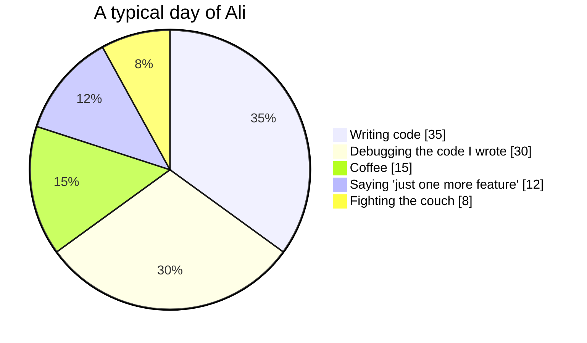

<!-- ===================== HEADER ===================== -->
<p align="center">
  
</p>

<p align="center">
  <a href="https://github.com/AliTaheriMotlagh">
    
  </a>
</p>

<p align="center">
  <a href="https://alitaherimotlagh.vercel.app/"></a>
  <a href="https://linkedin.com/in/alitaherimotlagh"></a>
  <a href="https://linktr.ee/alanfilm"></a>
  <a href="https://www.youtube.com/@Alitaherimotlagh"></a>
  <a href="https://siktir-backend.onrender.com"></a>
</p>

<p align="center">
  
  
  
  
  
</p>

---

## 🎮 Player 1 Has Entered the Game

```ts
const ali = {
  class: "Software Engineer 🧙‍♂️",
  level: 30,                     // and still respawning
  location: "Tehran, Iran 🇮🇷",
  hp: "151.10 kg — heavyweight dev 🏋️ (tank build, high HP)",
  currentQuest: "building a brand-new company 🏗️",
  skillTreeInProgress: ["Angular", "TypeScript (deeper)"],
  inventory: ["☕ infinite coffee", "⌨️ mechanical keyboard", "🎬 a camera (AlanFilm)"],
  lookingFor: "a party to raid new ideas with 🤝",
  askMeAbout: "anything 💬",
  weakness: "the corner of the couch 🛋️🦶",
};
```

<details>
<summary>📈 <b>Character stats</b> (click to inspect)</summary>
<br/>

```text
STR  ████████████████████  20  // see: hp
INT  ████████████████░░░░  16  // wrote a SignalR server in Node for fun
AGI  ██████████░░░░░░░░░░  10  // can dodge meetings, not furniture
CHA  ██████████████░░░░░░  14  // will make you a short film about it
LUCK ████░░░░░░░░░░░░░░░░   4  // pushed to main on a Friday once
```

</details>

---

## 🏝️ Start Here: Drive Through My Portfolio

<table>
  <tr>
    <td valign="top">
      <h3>🚗 <a href="https://github.com/AliTaheriMotlagh/atm">Ali's Project Island</a></h3>
      <p><b>A portfolio you don't scroll. You drive it.</b> Hop in a car and cruise around a 3D island where every landmark is one of my projects. Pull up to one to open its dossier with a live preview, source links and recent commits, plus <b>21 project-themed mini-games</b> (land a plane, find the midpoint, sort an array, whack a link…). There's a drive-in cinema playing my short films too. 🍿</p>
      <p>
        
        
        
        
      </p>
      <a href="https://alitaherimotlagh.vercel.app/">🏁 Start driving</a> ·
      <a href="https://github.com/AliTaheriMotlagh/atm">💻 Source</a>
    </td>
  </tr>
</table>

---

## 🗺️ Choose Your Level

<table>
  <tr>
    <td width="50%" valign="top">
      <h3>⚔️ <a href="https://github.com/AliTaheriMotlagh/streetquest">StreetQuest</a></h3>
      <p><b>A GPS war game played on real streets.</b> Imagine <i>Generals: Zero Hour</i>, <i>The Sims</i>, <i>Counter-Strike</i> and <i>Clash of Clans</i> all ended up in one app. Plant a base where you're standing, build towers on your block, march squads across the actual map, breach rival bases in first-person and nuke someone 5 km away while they run for it. ☢️🏃</p>
      <p>
        
        
        
        
      </p>
      <a href="https://streetquest-free.vercel.app">🌐 Go outside &amp; play</a> ·
      <a href="https://github.com/AliTaheriMotlagh/streetquest">💻 Source</a>
    </td>
    <td width="50%" valign="top">
      <h3>🏭 <a href="https://github.com/AliTaheriMotlagh/nexus-scada">Nexus SCADA</a></h3>
      <p><b>An industrial HMI/SCADA and home-automation platform, all in TypeScript.</b> It does live tags, ISA-18.2 alarms, a historian, trends, a drag-and-drop graphics designer, 3D plant scenes, Modbus/MQTT drivers and a SignalR hub I reimplemented in Node. Run a factory or just your living-room lights. 💡</p>
      <p>
        
        
        
        
        
      </p>
      <a href="https://nexus-scada.onrender.com/">🌐 Live demo</a> (<code>operator/operator</code>, give it a minute to wake up 😴) ·
      <a href="https://github.com/AliTaheriMotlagh/nexus-scada">💻 Source</a>
    </td>
  </tr>
  <tr>
    <td width="50%" valign="top">
      <h3>🎧 <a href="https://github.com/AliTaheriMotlagh/remixt">Remixt</a></h3>
      <p><b>Split any song &amp; remix it your way.</b> A DAW that runs in your browser. Upload a track and it gets split into vocals and beat right there (Demucs on ONNX Runtime Web). Then drop any vocal over any beat, match BPM, shift pitch and publish your remix. 🎤🥁</p>
      <p>
        
        
        
        
      </p>
      <a href="https://remixt-free.vercel.app">🌐 Drop the beat</a> ·
      <a href="https://github.com/AliTaheriMotlagh/remixt">💻 Source</a>
    </td>
    <td width="50%" valign="top">
      <h3>✈️ <a href="https://github.com/AliTaheriMotlagh/khalabani">Khalabani: Avalon Flight Simulator</a></h3>
      <p><b>Fly an Airbus A320 out of Tehran Mehrabad, in your browser.</b> It has fly-by-wire control laws, ECAM pages, a working MCDU, and an autopilot with autoland and TCAS. There's also a Cessna 172 for IFR training, and touch controls on phones and tablets. 🛫</p>
      <p>
        
        
        
      </p>
      <a href="https://khalabani.vercel.app">🌐 Cleared for takeoff</a> ·
      <a href="https://github.com/AliTaheriMotlagh/khalabani">💻 Source</a>
    </td>
  </tr>
  <tr>
    <td width="50%" valign="top">
      <h3>📍 <a href="https://github.com/AliTaheriMotlagh/vasat-yab">VasatYab</a></h3>
      <p><b>The Midpoint Calculator.</b> Enter two addresses and it finds the perfect meeting spot right in the middle, so nobody has to argue about who drives further. 🤝</p>
      <p>
        
        
      </p>
      <a href="https://vasatyab.vercel.app/">🌐 Meet in the middle</a> ·
      <a href="https://github.com/AliTaheriMotlagh/vasat-yab">💻 Source</a>
    </td>
    <td width="50%" valign="top">
      <h3>😜 <a href="https://siktir-backend.onrender.com">siktir-backend.onrender.com</a></h3>
      <p><b>A just-for-fun side project,</b> because not every project has to be serious. Some of them just have to be funny. 🤪</p>
      <p>
        
        
      </p>
      <a href="https://siktir-backend.onrender.com">🌐 Visit</a>
    </td>
  </tr>
</table>

<p align="center">
  <a href="https://github.com/AliTaheriMotlagh/streetquest"></a>
  <a href="https://github.com/AliTaheriMotlagh/nexus-scada"></a>
  <a href="https://github.com/AliTaheriMotlagh/remixt"></a>
  <a href="https://github.com/AliTaheriMotlagh/khalabani"></a>
  <a href="https://github.com/AliTaheriMotlagh/atm"></a>
  <a href="https://github.com/AliTaheriMotlagh/vasat-yab"></a>
</p>

---

## 🏅 Achievements Unlocked

| | Achievement | How |
|:-:|---|---|
| ✈️ | **Pilot Without a License** | Built an A320 with a working MCDU and autoland |
| ☢️ | **Real-World Warlord** | Put nukes on a map of actual streets (in a game, relax) |
| 🏭 | **Factory Whisperer** | Wrote a SCADA system from tags to alarms to historian |
| 🎧 | **Bedroom Producer** | Taught a browser to split vocals from beats |
| 🏝️ | **Island Owner** | Turned a CV into a drivable 3D island |
| 🎬 | **Director's Cut** | Shot short films on [AlanFilm](https://www.youtube.com/@Alitaherimotlagh) |
| 🛋️ | **Furniture's Nemesis** | See *Dev Joke* below |

---

## 📊 How My Day Actually Goes



---

## 🛠️ Inventory (Tech Stack)

<p align="center">
  
</p>

---

## 📈 Scoreboard

<p align="center">
  
  
</p>

<p align="center">
  
</p>

<p align="center">
  
</p>

### 🏆 Trophy Room

<p align="center">
  
</p>

---

## 🐍 Boss Fight: The Snake vs. My Contributions

<p align="center">
  <picture>
    <source media="(prefers-color-scheme: dark)" srcset="https://raw.githubusercontent.com/AliTaheriMotlagh/alitaherimotlagh/output/github-snake-dark.svg" />
    <source media="(prefers-color-scheme: light)" srcset="https://raw.githubusercontent.com/AliTaheriMotlagh/alitaherimotlagh/output/github-snake.svg" />
    
  </picture>
</p>

<p align="center"><i>Every green square I make, he eats. It's a never-ending side quest.</i></p>

---

## 😂 Dev Joke

<p align="center">
  <i>"Ye roz ye barnamenevise angoshte pash mikhore be on zire mobl"</i> 🦶💥🛋️
</p>

<details>
<summary>🤫 <b>Don't click this</b></summary>
<br/>

```diff
- I told you not to click it.
+ But you did, so you're clearly the curious type I want on my team.
+ Achievement unlocked: 🕵️ Easter Egg Hunter
+ Reward: go fly a plane → https://khalabani.vercel.app
```

</details>

## 💭 Quote of the Moment

<p align="center">
  
</p>

---

## 🤝 Player 2, Press Start

I'm looking for teammates to build fun, useful products. Got an idea? Let's start a co-op run! 🕹️

<p align="center">
  <a href="https://alitaherimotlagh.vercel.app/">🏝️ Portfolio island</a> ·
  <a href="https://linkedin.com/in/alitaherimotlagh">💼 LinkedIn</a> ·
  <a href="https://www.youtube.com/@Alitaherimotlagh">🎬 AlanFilm</a> ·
  <a href="https://linktr.ee/alanfilm">🌳 All my links</a> ·
  <a href="https://github.com/AliTaheriMotlagh?tab=repositories">📦 All repos</a>
</p>

<p align="center">
  
</p>
